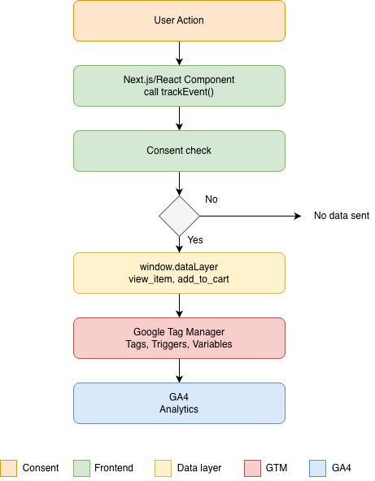

# MakeupMe — Ecommerce Tracking & Analytics

GTM + GA4 implementation for ecommerce analytics using react-gtm-module


## Architecture 



## What's Implemented 
### Phase 1: Core Tracking (Live)
- **Google Tag Manager** — Event collection & routing
- **Google Analytics 4** — Real-time analytics dashboard
- **Basic consent + localStorage**
- **Ecommerce events (Temporary):**
  - `view_item` 
  - `add_to_cart` 
  - `page_view` 


## Tech Stack
- **Frontend:** Next.js, React, TypeScript
- **Analytics:** Google Tag Manager, Google Analytics 4
- **Tracking:** react-gtm-module (consent-based initialization)
- **Storage:** localStorage (consent persistence)
- **Styling:** Tailwind CSS

## Key Technical Decisions
### 1. Why react-gtm-module? 
- Reason: Supports conditional initialization based on consent 
- Alternative considered: @next/third-parties (but injects during SSR, cannot be conditional)
- **Result:** GDPR-compliant, user consent respected before tracking

## How to Setup
### 1. Environment Variables
```bash
NEXT_PUBLIC_GTM_ID=GTM-XXXXXXX
```

### 2. GTM Dashboard Configuration
- GA4 Event Tag (All Custom Events trigger)
- dlv_event variable (Data Layer Variable)
- ecommerce variable (Data Layer Variable)


### 3. Test
```bash
npm run dev
# Accept consent cookie
# Trigger events (view product, add to cart)
# Check GA4 Realtime dashboard
```

### How it works
1. User visits → Banner appears
2. User clicks Accept → localStorage set, GTM initializes
3. GTM routes events to GA4
4. Data collected with user permission


## Metrics
| Metric |
|--------|
| Website visitors |
| Product views |
| Add to cart |
| Real-time tracking |


